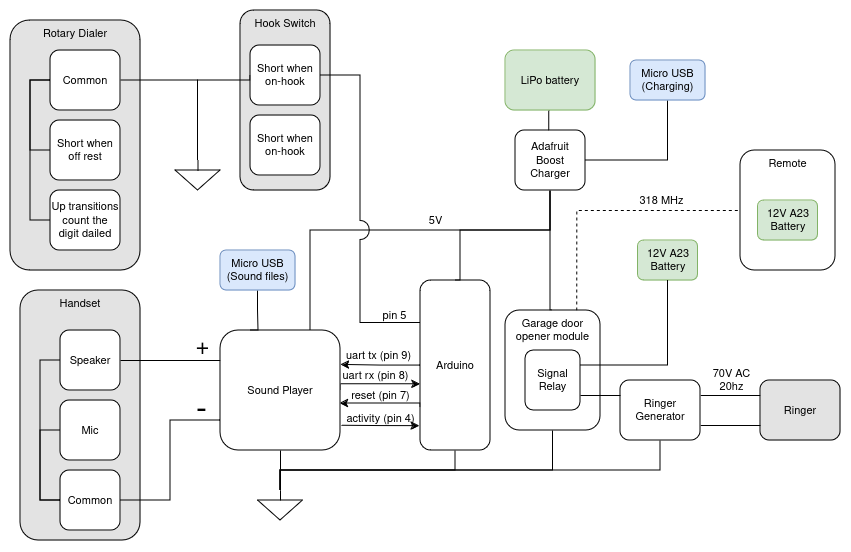

# arduino_rustyscalling
Replace the guts of a vintage telephone for fun and... more fun!

## Features
* Remote ringing!
* Plays random sound clips when you pick up!
* Rechargeable!
* 100% Recycled Jokes!

## Parts
* **Telephone**: [Connecticut Telephone Inc 1000-JD](https://www.ebay.com/sch/i.html?_nkw=Connecticut%20Telephone&siteid=0&customid=&toolid=10001)
* **Sound Player**: [Adafruit Audio FX Sound Board + 2x2W Amp - WAV/OGG Trigger - 16MB](https://www.adafruit.com/product/2217)
* **Arduino**: [Arduino Pro Mini](https://www.sparkfun.com/products/11113)
* **Boost charger**: [PowerBoost 500 Charger - Rechargeable 5V Lipo USB Boost @ 500mA+](https://www.adafruit.com/product/1944)
* **Garage Door Opener Module**: [GTO RB709 UNB Universal Receiver - 318Hmz](https://www.gateopenersunlimited.com/gto_receiver_gto_rb709_unb_universal_receiver_gto_garage_door_opener.html)
* **Remote**: [GTO RB741 Remote Control Two Button Transmitter (Older Model)](https://www.gateopenersunlimited.com/GTO-RB741-Remote-Control-Two-Button-Transmitter--2-Pack_p_254.html)
* **Ringer Generator**: [Ringing Generator Module and Ringer (Ringing Generator Only)](https://www.modelrailroadcontrolsystems.com/ringing-generator-module-and-ringer/)

# Wiring Schematic

